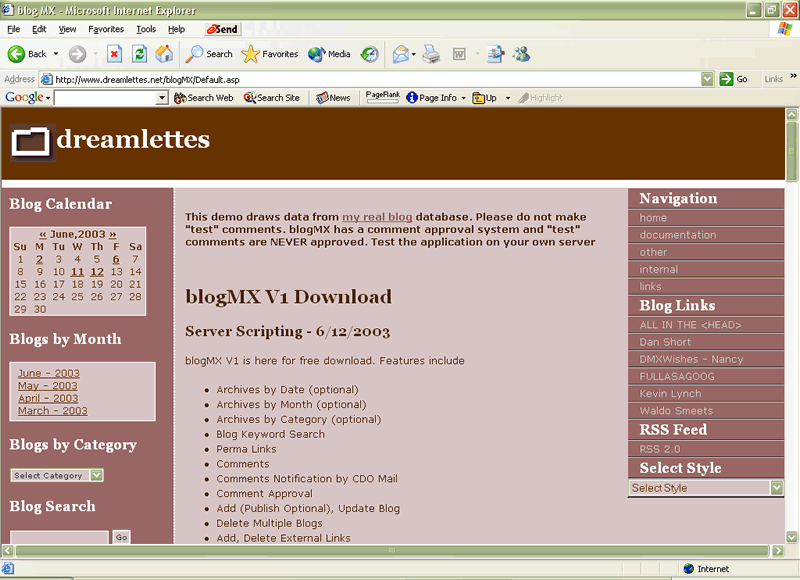



## blogMX Version 1

### Description

blogMX is a blogging application. Lets you create your online journal/weblog. It auto generates your RSS file for syndication.
 
### More Info
 

             |
---                |---
**Submitted On**   |2003-06-11 19:26:00
**By**             |[Ranjan Datta](https://github.com/Planet-Source-Code/PSCIndex/blob/master/ByAuthor/ranjan-datta.md)
**Level**          |Intermediate
**User Rating**    |5.0 (10 globes from 2 users)
**Compatibility**  |ASP \(Active Server Pages\) 
**Category**       |[Complete Applications](https://github.com/Planet-Source-Code/PSCIndex/blob/master/ByCategory/complete-applications__1-27.md)
**World**          |[Visual Basic](https://github.com/Planet-Source-Code/PSCIndex/blob/master/ByWorld/visual-basic.md)
**Archive File**   |[blogMX\_Ver1604826232003\.zip](https://github.com/Planet-Source-Code/ranjan-datta-blogmx-version-1__1-46379/archive/master.zip)

